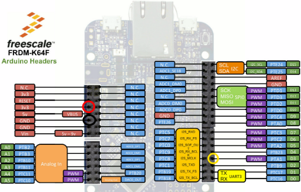

# SX Create: Making music on a microcontroller, instructions

Welcome to our session at SX Create! If you have any questions, please just give a shout out to Austin, Jan or Gregory, we're here to help everyone make the most of today.

In this session we'll work through eigth examples together. Jan will demonstrate everything, but this document should help you in case you're stuck or did not completely follow along. If you feel you're way faster than everyone else, we have some extra tasks at the bottom of each example. Please do not get ahead, the later examples all do something with music, and that will be very annoying for the other participants. :-)

Reading this doc after SXSW? Not a problem. Get a FRDM-K64F dev board and some piezo buzzers and pads, and follow along.

> If you happen to much faster than everyone else, help your neighbours. We're at SXSW, we're social!

## Setup

1. Connect the FRDM-K64F board to your computer. There's 2 micro-USB ports on the board, use the OpenSDA one!
1. The board mounts as a mass-storage device (like a USB drive). Verify that you can see it (drive name will be MBED).
1. Click on [this link](https://c9.io/auth/mbed?r=https%3A%2F%2Fc9.io%2Fopen%3FworkspaceType%3Dmbed%26clone_url%3Dhttps%3A%2F%2Fgithub.com%2Fjanjongboom%2Fsxsw.git).
1. You will be asked to create an ARM mbed account, do so.
1. Afterwards, you'll be redirected to the 'Create new workspace' page. Scroll to the bottom and click 'Create workspace'

An IDE should open. Congratulations!

**On Windows:** For basic usage you don't need to install anything, but if you want to see debug messages, install the [serial driver](https://developer.mbed.org/handbook/Windows-serial-configuration).

**Debug messages:** We can talk to the board via a serial port, but you might need some software. Read [this doc](https://developer.mbed.org/handbook/SerialPC#host-interface-and-terminal-applications) and install required software (like PuTTY on Windows).

**Locally:** If you like things locally, you can do so by installing [yotta](https://docs.mbed.com/docs/getting-started-mbed-os/en/latest/installation/), then cloning the repo. If you want to build a project, go to the project folder and run:

```bash
$ yt target frdm-k64f-gcc # our board
$ yt build
$ cp build/frdm-k64f-gcc/source/*.bin /Volumes/MBED
```

I very much recommend to just use the online IDE, as it makes it easier for us, but if you want to continue hacking in the future, this is a nice way.

## 1. Blinky

1. First we need to set up our project and our target. In the button next to 'Build' in Cloud9, select '1_blinky'.
1. On the button next to that, click 'Search in registry' and select 'frdm-k64f-gcc'.
1. Open sxsw/1_blinky/source/main.cpp in the tree.
1. We need to implement a function that will blink the LED.
1. Under '// YOUR CODE HERE' add the following code

```cpp
static void blinky() {
    // the LED is either on or off (a 1 or a 0). We can inverse the value with the `!` (inverse operator).
    // the flipped value is what we write back to the LED, thus toggling the LED.
    red = !red;
}
```

1. Now press 'Build' (in the top bar)
1. A file downloads (blinky.bin)
1. Drag the file to the 'MBED' disk
1. The green LED next to the USB cable will flash.
1. **After flashing, hit the 'Reset' button (next to the USB cable) to start the program.**
1. Blinky runs!

**Optional:** We use [minar](https://docs.mbed.com/docs/getting-started-mbed-os/en/latest/Full_Guide/MINAR/) as our event scheduler. We use it to periodically run the blinky function, but we can also use it to delay execution. E.g.:

```cpp
Scheduler::postCallback(blinky).delay(milliseconds(500));
```

Will call `blinky` once, in 500 ms. But does not repeat the process. Rewrite the app to use `delay` instead of `period`, but let it still blink the LED. Afterwards see if you can vary the time between blinks ([hint](http://www.cplusplus.com/reference/cstdlib/rand/)).

## 2. Two buttons, two colors

1. Switch projects, click `1_blinky`, and change to `2_two_buttons`
1. Open sxsw/2_two_buttons/source/main.cpp
1. We want to execute a function when the button is clicked
1. We already have code in place which responds when the buttons 'fall', which means the button is pressed
1. Let's write similar code as before, but now with two functions (one for green, one for red)
1. Under '// YOUR CODE HERE' add the following code

```cpp
static void toggle_red() {
    red = !red;
}
static void toggle_green() {
    green = !green;
}
```

1. Hit the Build button and flash the application. Clicking SW2 and SW3 will now toggle the LEDs. Having them both on will also allow you to create yellow.

**Optional:** We use `fall` currently, which triggers when the button is clicked. We can also use `rise` to get an event when the button is no longer clicked. Change the code so that the LEDs only burn when the button is pressed down.

**Optional 2:** When we start a periodic timer with minar, we can cancel the timer as well via:

```cpp
callback_handle_t callback = Scheduler::postCallback(blinky).period(milliseconds(500)).getHandle();
Scheduler::cancelCallback(callback);
```

Use the above pattern to combine 1. and 2. Pressing the button should start blinking the color, instead of turning it on. Pressing the button again should cancel the blinking.

## 3. Sound instead of color

1. Switch projects, click `2_two_buttons`, and change to `3_sound`
1. We have a buzzer, which we can use instead of the color as an output
1. If the buzzer is not yet connected to your board, do xyz
1. We use pulse width modulation to create the square waves, the buzzer is connected to pin 3
1. We have a `play_tone` function, now let's hook it up...
1. Under '// YOUR CODE HERE' add the following code

```cpp
static void play_note1() {
    play_tone(NOTE_C4, 200);
}
static void play_note2() {
    play_tone(NOTE_D4, 200);
}
```

1. Build and flash, when hitting the buttons you'll now get sound (a C and a D tone)
1. Try and play with different tones and tone lengths

**Optional:** Currently tones have fixed length. Change the code to play a tone when the button fall's, and call silence when button rise's. This should give you the ability to play some small (two-tone) songs. Look in the directory for '4_accelerometer' for hints.

### Disconnected buzzer

If you disconnected the buzzer by accident, no worries! Here's how you reconnect it:



You buzzer has four pins (red, black, yellow and white). Plug the red, black and yellow cables in according to the schema above (white is unused). Always use the **outer** lane on the board, not the inner pins.

For the fast learners: that's red=3.3V, black=GND, yellow=D3.

## 4. More inputs!

1. Switch projects, click `3_sound` and change to `4_accelerometer`
1. We're going to use the accelerometer movement detector to play a sound too, this means we can knock the board on a table and get a sound
1. A new library is included which does this for you already
1. At the bottom of main.cpp you'll see initialization logic for the accelerometer
1. When the accelerometer triggers (movement detected), we can execute some code again
1. Under '// YOUR CODE HERE (1)' add the following code:

```
static void play_note3() {
    play_tone(NOTE_E4);
    
    Scheduler::postCallback(silence).delay(milliseconds(200));
}
```

1. We manually call `silence` now to get predictable behavior
1. Try and change the code to use `accel_interrupt_pin.rise` to silence instead (remove the Scheduler call from play_note3 as well). See what it does.
1. Change the notes and play some simple melodies

**Optional:** You can read the data from the accelerometer (x, y, z axis) via:

```cpp
static void read_accel() {
    SRAWDATA accel_data;
    SRAWDATA magnet_data;
    accel.get_data(&accel_data, &magnet_data);
    
    // this will show up in PuTTY
    printf("x=%d y=%d z=%d\r\n", accel_data.x, accel_data.y, accel_data.z);
}
```

Use minar to read the data every 10 ms., then use the value from the accelerometer (e.g. `accel_data.z`) and feed it into `play_tone` function. We can now change the sound depending on how you hold the device in physical space. Allow to pause the sound by pressing one of the buttons.

You can play with the distribution of the tone. Just feeding the raw data into the algorithm doesn't generate the nicest effect.

## 4b. Adding pads

1. We can add vibration pads as well, although this requires a bit of assembly
1. Take one of the pads from the front
1. Put the red cable into A0 ([pinout](https://developer.mbed.org/media/uploads/GregC/xfrdm-k64f_header-pinout.jpg.pagespeed.ic.GDev93u6zd.jpg))
1. Put the black cable in one of the GND

Now under 'YOUR CODE HERE (2)' add:

```cpp
    auto v = pad.read_u16();
    if (v == 65535 && !is_pad_high) {
        play_tone(NOTE_F4);
        Scheduler::postCallback(silence).delay(milliseconds(200));
    }
    
    is_pad_high = v == 65535;
```

Now when we hit the pad, we get to play a tone! It's possible to detect how hard you hit the pad as well, but this requires a 1M Ohm resistor, which I do not have at hand unfortunately. If we do have them, hook the resistor up from A0 to ground, now the readings will be much better.

Because the above, we can only detect hits every ~1s.

### If we found resistors

If we did find resistors, change the code to:

```cpp
    auto v = pad.read_u16();
    if (v > 1000 && !is_pad_high) {
        play_tone(NOTE_F4);
        Scheduler::postCallback(silence).delay(milliseconds(200));
    }
    
    is_pad_high = v > 1000;
```

You can vary the sound depending on the value of the input (1000 is pretty soft tap, 30000 a lot louder).

## 5. Songs

1. Switch projects, click `4_accelerometer` and change to `5_songs`
1. We can play tones from various inputs, but we could also play songs that we program in
1. We create a simple format to write notes (in app_start).
1. Now we need to write the code that will play this format.
1. Our `play_song` function takes 3 arguments:
    * The number of notes left
    * The notes left (as a pointer)
    * The durations left (as a pointer)
1. Every time we call this function we subtract 1 from the notes left, and up the notes and durations. When we reach 0 we're done.
1. We add a pause between each note as well.
1. Under 'YOUR CODE HERE' insert:

```cpp
    // melody and duration are pointers, they point to the array of tones and durations we declared earlier
    // every time we call this function, we up these pointers (move one element forward)
    // so the current tone is always the first element of melody (same for duration)
    int tone = melody[0];
    // BPM is quarter notes per minute, so length in milliseconds is:
    int length = static_cast<int>(static_cast<float>(1000 / duration[0]) * (60000.0f / static_cast<float>(BPM * 1000)));
    
    play_tone(tone);

    // is this the last tone?    
    if (notes_left - 1 == 0) {
        // we're done! just finish this note and silence
        Scheduler::postCallback(silence).delay(milliseconds(length / 2));
    }
    else {
        // after half the length of this tone, we silence
        Scheduler::postCallback(silence).delay(milliseconds(length / 2));
        
        // after the full length of this tone, we call ourselves, but up the melody, and down the notes_left
        FunctionPointer3<void, int, int*, int*> fp(play_song);
        Scheduler::postCallback(fp.bind(notes_left - 1, melody + 1, duration + 1)).delay(milliseconds(length));
    }
```

1. Delete the pause between the notes, what do you see?
1. Find some melody and program it in, make some of your own music. Play with the BPM as well to speed things up or slow things down.

**Optional:** Add some LED effects whenever songs are playing. Toggle colors (we have red, green, blue LEDs on the board) depending on the tone.

## 6. Songs from the cloud

We'll be connecting the device to the internet now. First let's build the firmware for the device.

1. Switch projects, click `5_songs` and change to `6_songs-from-the-cloud`.
1. Go to https://connector.mbed.com/, and sign in.
1. Now click on 'Security Credentials' and click 'Get my Security Credentials'.
1. Copy everything in the gray box.
1. Make a new file 'sxsw/6_songs-from-the-cloud/source/security.h' and paste the content in.
1. Plug in an ethernet cable and hit 'Build'.
1. Flash your device. After a couple of seconds the GREEN led should turn on.
1. Go to https://connector.mbed.com/#endpoints, a device should have appeared.
1. Hurray, your device is connected to the internet!

Now we want to start a web application which can talk back to the device.

1. Open `sxsw/6_songs-from-the-cloud/web/server.js`.
1. We need an access key (API key), go to https://connector.mbed.com/#accesskeys and get an access key.
1. In server.js, fill in the key on line 1 (between the quotes), so we'll get something like `var accessKey = 'ABCDEF';`.
1. In the tree, right click on the 'web' folder (under 6_songs-from-the-cloud) and choose 'Open terminal here'. A terminal window will open.
1. Type `node server.js` and hit enter.
1. After a few seconds a link will appear. Click on it, and select 'Open'.
1. A web page opens and your device will be there. Click on the device, and on the next page click 'Play'.
1. We can send new sounds to the board, f.e. via the 'Set Mario' button. Wait until you get an alert and press 'Play' again.
1. **HOLD YOUR FINGER ON THE BUZZER, THIS WILL BE LOUD!**
1. You can write some new songs from JavaScript (in sxsw/6_songs-from-the-cloud/web/views/instrument.html) now.

**Optional:** Look into how we send values to the cloud. Add a way of setting the BPM from the web app as well.

**Optional 2:** We can get events when a resource on the device changes (via `mbed_client_set()`) in the web app. See if we can store here whether we're playing a song currently and stream that data back to the web app ([hint](https://github.com/janjongboom/mbed-knock-detector/blob/master/web/server.js#L52)).

## 7. Changing waveforms

1. We can change the waveforms to make more complicated sounds.
1. We'll keep using 6_songs-from-the-cloud
1. We can make a sound fade away at the end of the tone, changing the sound completely... Change the `playTone` function to read:

```cpp
static void playTone(int tone, int duration) {
    for (long i = 0; i < duration * 1000L; i += tone * 2) {
        // let's change the buzzer's volume depending on how far we are
        float pct = (float)i / (float)(duration * 1000L);

        buzzer = (1 - pct) / 4; // high to low
        wait_us(tone);
        buzzer = 0.0f;
        wait_us(tone);
    }
}
```

1. Build and flash, and start playing from the web app again. Compare it with the previous version (perhaps if your neighbour did not flash yet).
1. Similarly we can emulate sine-waves, changing the sound even more:

```cpp
#define PI 3.14159265
static void playTone(int tone, int duration) {
    for (long i = 0; i < duration * 1000L; i += tone * 2) {
        // let's change the buzzer's volume depending on how far we are
        float pct = (float)i / (float)(duration * 1000L);

        // make 4 sinus forms (8 * PI), then map it from -1..1 to 0.1..0.6,
        // then divide by 8 to not make too much sound
        buzzer = (sin(pct * (8 * PI)) / 2 + 0.6) / 8;
        wait_us(tone);
        buzzer = 0.0f;
        wait_us(tone);
    }

    buzzer = 0.0f;
}
```

1. Change the number of sine-waves, and find something that sounds nice (try 2 or 3), or go higher.

**Optional:** You can combine two or more sine-waves to emulate chords. Try it out. It'll take a bit of math [hint](http://betterexplained.com/articles/intuitive-understanding-of-sine-waves/).

## 8. Recording a sequence and sending it back

1. Back in example 4 we had all these inputs, now let's record that and send it back to the cloud. From there we can then play it with proper samples.
1. Switch projects, click `6_songs-from-the-cloud` and change to `8_sequence`.
1. Copy 'security.h' from 6_songs-from-the-cloud/source/security.h to 8_sequence/source/security.h
1. Let's record what we're doing, f.e. when we hit which button, or pad. We have the same interrupts already set up, so let's implement the functions we had before.

If you now take a look at the `play_note1` function, you'll see that the code has changed a bit. We call a function `save_event` whenever the function is called. In this function we pass in the identifier of our input (buttons or accelerometer). If you add pads to this installation, you can give them new unique identifiers as well.

1. Let's implement the save_event function. It will store the current value of the device clock, along with the ID. So later we know at which point which input was activated.
1. Under 'YOUR CODE HERE (1)' insert:

```cpp
static void save_event(int id) {
    // we're gonna make a set of characters (string) via a stringstream
    std::stringstream ss;
    ss << id;
    ss << ",";
    ss << (us_ticker_read() / 1000L) - start_time;
    // the output is now something like '1,3500' (if you pressed input 1 at 3500 ms. after recording)
    // this was one of many events, so we'll hold all events in the `sequence` variable (which is a vector (like a list or array))
    sequence->push_back(ss.str());
    
    last_event = us_ticker_read() / 1000L;
}
```

1. The countdown sequence is already programmed in (see `countdown`), so we just need to find out when you stopped playing. We got some code that checks if no events came in for 5 seconds already.
1. Under 'YOUR CODE HERE (2)' insert:

```
        // note that we're not recording anymore (so inputs don't have any effect anymore)
        recording = false;
        // blink the blue LED to note that we're done
        Scheduler::postCallback(blink_blue).period(milliseconds(500));
        
        // combine all the values in `sequence` into one big string
        // it'll look like 1,3500:2,3550:
        std::stringstream ss;
        for (uint8_t i = 0; i < sequence->size(); i++) {
            ss << sequence->at(i);
            ss << ":";
        }
        // send the data to the cloud
        mbed_client_set("buzzer/recorded", ss.str());
```

1. Build and flash your device. On startup, wait until the LED is green, after that it will blink 3 times, now it's recording. Hit the buttons and knock on the table to record. 5 seconds after you stopped doing anything the blue LED will blink, indicating that the recording was finished.

### Web app

1. Let's do something with the data we just recorded, like playing it back with nicer samples over your computer speaker!
1. Open 'sxsw/8_sequence/web/server.js' and paste in the access key from 6.
1. In the tree, right click on 'sxsw/8_sequence/web' and select 'Open terminal here'
1. In the terminal run `node server.js`
1. After a few seconds a link will appear. Click on the link and select 'Open'.
1. A web page opens and your device should be there. Click on the device, and you should see the sequence you just recorded (in the form of `1,3500:2,3550`).
1. Let's play this sequence over your computer speaker. Already included are some samples for the hi-hat, kick drum, and the snare drum.
1. In sxsw/8_sequence/web/views/instrument.html, under YOUR CODE HERE insert:

```js
    // loop over all the inputs
    song.forEach(function(note) {
      // the sample we'll use (f.e. 1=hat)
      var sample = mapping[note[0]];
      // the timing (how long after we start playing should this happen)
      var timing = note[1];
      
      // after timing ms.
      setTimeout(function() {
        // we'll play the sample
        document.querySelector('#' + sample).play();
      }, timing);
    });
```

1. Refresh the page and hear yourself jamming (it takes a while to get this sound right ;-)).
1. Automatically when you record a new set, we'll automatically stream it to the web app (via a web socket), so hit the RESET button on your device, play a new rhythm, and it will play back straight away!

**Optional:** Get some new sound effects from a website like [this](http://drumhits.biz/free-drum-samples/cat_view/4-free-drum-samples) and create your own sound.

**Optional 2:** Add some more inputs, f.e. one of the pads that we have at the front. They make it a lot easier to hold rhythm as well, as you're tapping them.

**Optional 3:** Currently we have to hit the RESET button on the device to restart recording. Can you create a way of changing this so by (f.e.) holding one of the buttons we restart?
